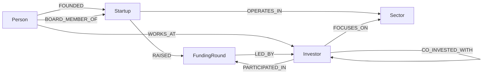

# IntroGraph

**Startup ↔ investor matchmaking, and the shortest path to a warm introduction — built on CognoDB, a managed graph database.**

Take-home submission for the Wexa AI "Build a Graph Database Application" assignment.

---

## 1. The use case

Aditya pitched this as: *different venture profiles for different startups, matched against how much (and what kind of) funding a venture firm can actually do.*

IntroGraph turns that into a small, focused product: a startup that's currently fundraising gets a ranked list of investors whose sector focus, stage and typical check size genuinely fit — not a static directory, but a live match against the graph. For every match, it also answers the question that actually determines whether a founder gets a meeting: **do we know anyone who can make the introduction?** It searches the network of founders, board seats, funding-round participants and co-investment history for the shortest real path from the startup to that investor, and shows the exact chain of people and deals that connects them.

A secondary feature — portfolio conflict checking — flags when a candidate investor already backs a competitor in the startup's sector, which is exactly the kind of "does this edge already exist somewhere in the graph, N hops out" question a graph database answers naturally and a relational schema answers by way of a small forest of self-joins.

### Why a graph database?

The data itself is tabular-ish (startups, investors, funding rounds all have clean, fixed schemas), so on paper you *could* model this relationally. What breaks that plan is the two questions the product actually needs to answer:

- **"How is this startup connected to this investor?"** is not a lookup, it's a search — the connecting path could run through a co-founder who sits on another startup's board, whose investor co-invested in a round with the target fund, at a completely unknown, variable number of hops. In SQL this is a recursive CTE that unions across five or six join tables (people, startups, investors, funding rounds, board seats, co-investment pairs) with no clean way to bound or mix the relationship *types* along the way. In Cypher it's one `shortestPath()` pattern over a set of relationship types, and it stays one query no matter how deep the network gets.
- **"Does this investor already back a competitor of mine?"** requires walking investor → funding round → startup → sector → other startups → their funding rounds → their investors, and checking whether any of those investors is the one you're evaluating. That's a multi-way self-join in SQL that gets uglier every time the ownership chain gets one hop longer; in the graph it's a four-hop pattern match.

Both queries are really the same shape: *find out how two nodes relate through relationships nobody bothered to pre-compute.* That's the specific thing graph databases are for, and it's why the schema below is deliberately edge-heavy — the value here is in the connections, not the rows.

---

## 2. Data model

12 sectors, ~60 startups currently fundraising, ~40 investors, the people behind both sides, and every funding round that connects them.



| Node | Key properties |
|---|---|
| `Startup` | `id`, `name`, `tagline`, `description`, `stage`, `fundingAsk`, `location`, `foundedYear`, `teamSize` |
| `Investor` | `id`, `name`, `type`, `hq`, `minTicket`, `maxTicket`, `preferredStages[]`, `foundedYear`, `website` |
| `Person` | `id`, `name` — founders and investment partners are both `Person` nodes, distinguished by which relationship connects them |
| `Sector` | `id`, `name` — e.g. Fintech, AI/ML Infrastructure, Climate Tech |
| `FundingRound` | `id`, `roundType`, `amount`, `date`, `valuation`, `status` (`open` for the round a startup is currently raising, `closed` for history) |

`CO_INVESTED_WITH` is the one materialised/derived edge in the graph: it's computed once at seed time from shared `FundingRound` participation (`dealCount` = how many rounds two investors have co-invested in together), so the syndicate-network queries don't have to re-derive it from `PARTICIPATED_IN` on every request.

Every relationship type is intentionally directional and specific rather than a single generic `RELATED_TO` — that specificity is what lets the warm-intro query choose *which* relationship types are eligible for a path (see below) instead of walking the entire graph indiscriminately.

---

## 3. The main queries

All queries below run through the official Neo4j Python driver with parameters bound at the driver level (`session.run(query, {...})`) — nowhere in the codebase is a query string built by concatenating user input.

### 3.1 Investor matching (`backend/app/routers/matches.py::get_matches`)

A 2-hop traversal from the startup, through shared sectors, to candidate investors:

```cypher
MATCH (s:Startup {id: $startupId})
OPTIONAL MATCH (s)-[:OPERATES_IN]->(startupSector:Sector)
WITH s, collect(DISTINCT startupSector.name) AS startupSectors
MATCH (i:Investor)-[:FOCUSES_ON]->(sec:Sector)
WHERE sec.name IN startupSectors
WITH s, i, collect(DISTINCT sec.name) AS matchedSectors
...
RETURN i.id, i.name, ..., matchedSectors, sectorOverlap, stageMatch, ticketFit
ORDER BY sectorOverlap DESC, stageMatch DESC, ticketFit DESC
```

The API layer turns `sectorOverlap` / `stageMatch` / `ticketFit` into a 0–100% fit score and a plain-English reason string.

### 3.2 Warm-intro path — the multi-hop query (`get_warm_intro_path`)

The one a relational schema genuinely struggles with. Given a startup and a candidate investor that have **no direct edge between them**, find the shortest path through the human/deal network — founders, board seats, funding-round participation, co-investment — regardless of how many hops it takes or which of those relationship types it uses along the way:

```cypher
MATCH (start:Startup {id: $startupId}), (target:Investor {id: $investorId})
MATCH path = shortestPath(
    (start)-[:FOUNDED|WORKS_AT|BOARD_MEMBER_OF|PARTICIPATED_IN|RAISED|CO_INVESTED_WITH*..6]-(target)
)
RETURN [n IN nodes(path) | {id: n.id, labels: labels(n), props: properties(n)}] AS pathNodes,
       [r IN relationships(path) | type(r)] AS pathRelTypes
```

A typical result: `Anchorstack --[raised]--> Pre-Seed --[invested in]--> Clarity Collective --[co-invested with]--> Wilcox Ventures` — a 3-hop path through a round Anchorstack already closed and the syndicate partner of the investor who led it.

Why this is awkward in SQL: it's a variable-length path search across **six different relationship types stored in what would be at least five separate join tables** (`founders`, `partners`, `board_seats`, `round_participants`, `co_investments`), with no upper bound on depth known in advance. The SQL version is a recursive CTE that has to `UNION ALL` a step for every one of those tables at every recursion level, deduplicate visited nodes to avoid infinite loops, and still can't express "shortest path first" without materializing every path up to some hop limit and sorting. In Cypher it's the query above, and CognoDB (like any Bolt-speaking graph engine) can execute it efficiently because relationships are physically pointer-chased, not resolved via an index lookup per hop.

### 3.3 Portfolio conflict check (`get_conflicts`)

```cypher
MATCH (s:Startup {id: $startupId})-[:OPERATES_IN]->(sec:Sector)
MATCH (i:Investor {id: $investorId})-[:PARTICIPATED_IN]->(:FundingRound)<-[:RAISED]-(competitor:Startup)-[:OPERATES_IN]->(sec)
WHERE competitor.id <> $startupId
RETURN sec.name, collect(DISTINCT competitor) AS competitors
```

Four hops, one pattern. The SQL equivalent needs a self-join between the startup's sectors and every other startup's sectors, joined again through funding-round participation to the candidate investor, with an explicit `<>` guard to exclude the startup itself — doable, but the join count grows every time someone wants to add a relationship type to the conflict definition (e.g. "or a board member in common").

### 3.4 Syndicate / co-investment network (`get_syndicate_network`)

```cypher
MATCH (i:Investor {id: $id})-[c:CO_INVESTED_WITH]-(partner:Investor)
RETURN i, c.dealCount, partner
ORDER BY c.dealCount DESC
```

Powers the "who does this fund usually syndicate with" view on an investor's profile.

---

## 4. Application

FastAPI backend (`backend/`) + React/TypeScript frontend (`frontend/`), talking over a small JSON REST API. No framework-level ORM sits between the API and Cypher — routers call the Neo4j driver directly, which keeps the query-to-result mapping easy to read end to end.

- **Browse & filter** startups and investors by sector, stage and name.
- **Startup profile** — founders, funding history, sectors, currently-open round.
- **Matched investors** — ranked by fit, with a plain-English reason.
- **Warm-intro path finder** — expand any match to search the network live and render the connecting chain.
- **Portfolio conflict check** — expand any match to see if that investor already backs a competitor.
- **Investor profile** — partners, focus sectors, check size, co-investment/syndicate network.
- Loading skeletons, empty states, and a connection-status indicator in the nav bar that polls `/health` — if CognoDB is unreachable, every page shows a clear error banner instead of a blank screen or a stack trace.

| Browse & filter | Startup profile |
|---|---|
|  |  |

| Warm-intro path | Conflict check |
|---|---|
|  |  |

**Investor profile**


| Empty state | Database-unreachable state |
|---|---|
|  |  |

---

## 5. Project structure

```
intrograph/
├── backend/
│   ├── app/
│   │   ├── main.py          # FastAPI app, CORS, global error handler
│   │   ├── config.py        # env-var settings (no secrets hard-coded)
│   │   ├── db.py            # Neo4j driver wrapper + DatabaseUnavailableError -> 503
│   │   ├── models.py        # Pydantic request/response models
│   │   └── routers/         # sectors, startups, investors, matches (+ path, conflicts), network
│   ├── seed/
│   │   ├── data_gen.py      # generates the synthetic-but-realistic dataset
│   │   └── seed_data.py     # loads it into CognoDB via batched, parameterised Cypher
│   └── requirements.txt
├── frontend/
│   ├── src/
│   │   ├── api/client.ts    # typed fetch wrapper
│   │   ├── components/      # Nav, cards, PathVisualizer, loading/empty/error states
│   │   ├── pages/           # Home, Startup detail, Investors, Investor detail
│   │   └── types.ts
│   └── package.json
├── docs/screenshots/
├── render.yaml               # Render Blueprint for both services
└── .env.example
```

---

## 6. Running it yourself

### 6.1 Create your CognoDB instance

1. Sign up at [console.cognodb.com/signup](https://console.cognodb.com/signup) (free, no card required).
2. From the console, create a free **c0** instance and pick a region — it provisions in under a minute.
3. Save the connection URI (`bolt+s://<instance-id>.databases.cognodb.cloud`) and the generated password for the `cognodb` user **immediately** — it's shown once.

### 6.2 Configure environment variables

```bash
cp .env.example .env
```

Fill in `COGNODB_URI` and `COGNODB_PASSWORD` from step 6.1. Nothing in this repo reads secrets from anywhere else — the backend, the seed script, and the frontend build all read from environment variables.

### 6.3 Backend + seed data

```bash
cd backend
python3 -m venv .venv && source .venv/bin/activate
pip install -r requirements.txt

python -m seed.seed_data --reset      # loads ~60 startups, ~40 investors, ~450 nodes total
uvicorn app.main:app --reload --port 8000
```

Visit `http://localhost:8000/health` — you should see `{"status":"ok","database":true}`. Interactive API docs are at `/docs`.

### 6.4 Frontend

```bash
cd frontend
npm install
echo "VITE_API_BASE_URL=http://localhost:8000" > .env
npm run dev
```

Visit `http://localhost:5173`.

### 6.5 Verifying against a real Bolt server before you have CognoDB set up

Every query in this repo was developed and tested against a local Neo4j 5.24 Community server (same Bolt protocol, same driver, same Cypher dialect CognoDB speaks) before ever touching CognoDB, so the seed script and every endpoint are known-working over real Bolt — pointing `COGNODB_URI` at your CognoDB instance instead of `bolt://localhost:7687` is the only change needed.

---

## 7. Deploying

`render.yaml` at the repo root is a [Render Blueprint](https://render.com/docs/blueprint-spec) that deploys both services in one shot:

1. Push this repo to GitHub.
2. In Render: **New → Blueprint**, point it at the repo.
3. Render provisions `intrograph-api` (FastAPI, free web service) and `intrograph-frontend` (static site) from `render.yaml`.
4. Fill in the secret env vars it leaves blank: `COGNODB_URI`, `COGNODB_PASSWORD`, `CORS_ORIGINS` (the deployed frontend URL) on the API service, and `VITE_API_BASE_URL` (the deployed API URL) on the frontend service, then redeploy.

Any other free static/host + web-service pair (Railway, Fly.io, etc.) works the same way — the only requirement is that the backend host can hold a persistent process (for the Bolt driver's connection pool) rather than being pure serverless functions.

---

## 8. Engineering notes

- **Secrets**: `COGNODB_URI` / `COGNODB_USER` / `COGNODB_PASSWORD` are read from the environment (`backend/app/config.py`) and are in `.gitignore` via `.env`; only `.env.example` (no real values) is committed.
- **Error handling**: every driver call goes through `backend/app/db.py`, which converts connectivity failures into a single `DatabaseUnavailableError`. A global FastAPI exception handler turns that into a clean `503` with a user-facing message instead of a stack trace; the frontend's nav bar and every page-level fetch surface that as a banner, not a blank screen.
- **Parameterisation**: every Cypher query in the codebase is called as `run_query(query, {...params})` — never an f-string building the query itself. The one place a value is interpolated into a query string (`matches.py`, the `max_hops` bound on the path search) is a server-controlled, clamped integer (`2 ≤ max_hops ≤ 8` via FastAPI's `Query(..., ge=2, le=8)`), never user-supplied Cypher.
- Built with AI-assisted coding (Claude) for scaffolding and iteration speed — happy to walk through and defend any part of it.
